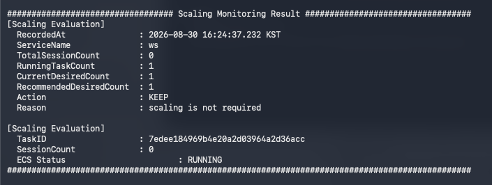
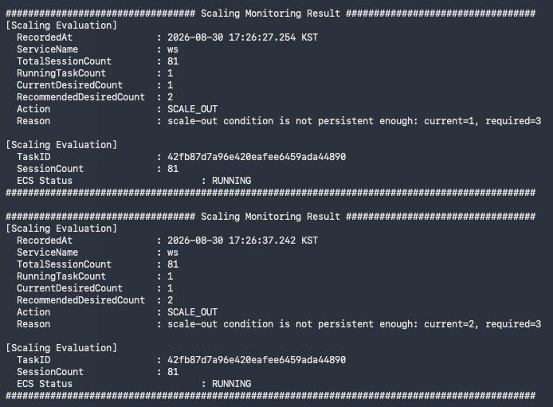
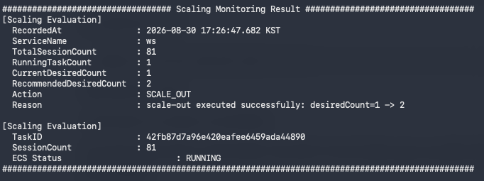
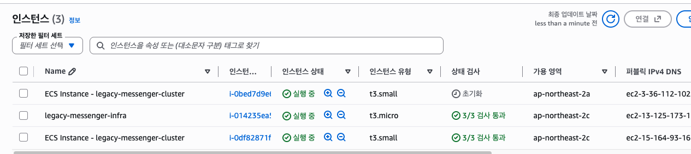
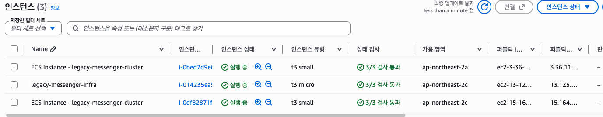
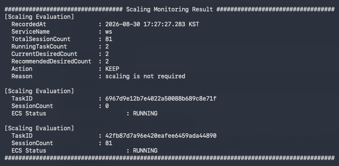

### TC-01. Normal Scale-out

#### Purpose

WebSocket session 부하가 Scale-out 임계치를 초과했을 때
Control Plane이 ECS Service의 desired count를 증가시키고,
필요한 경우 Capacity Provider / ASG를 통해 인프라 capacity까지 확장되는지 검증한다.

---

#### Scaling Policy

테스트 환경에서는 하나의 WebSocket Task가 최대 100개의 session을
처리할 수 있다고 가정한다.

| Policy | Value |
|---|---:|
| Task Maximum Capacity | 100 sessions |
| Scale-out Threshold | 80 sessions (80%) |
| Scale-out Condition Consecutive Count | 3 |
| Scale-out Step | +1 |
| Min Desired Count | 1 |
| Max Desired Count | 2 |

Task가 최대 수용량에 도달하기 전에 신규 Task가 준비될 수 있도록
20%의 capacity buffer를 확보하기 위해 80%를 임계치로 설정하였다.

또한 일시적인 session 증가로 인해 불필요한 Scale-out이 발생하지 않도록
Scale-out 조건이 연속 3회 확인된 경우에만 실제 capacity를 증가시킨다.

> 해당 수치는 Control Plane 동작 검증을 위한 테스트 기준이며,
> 실제 운영 임계치는 부하 테스트 결과를 기반으로 산정해야 한다.

--

#### Initial State

| Item | Value |
|---|---:|
| Active Sessions | 0 |
| ECS Desired | 1 |
| ECS Running | 1 |
| ECS Pending | 0 |
| ASG Desired | 1 |
| EC2 InService | 1 |

#### Test Procedure

1. Session Provider를 통해 Task A의 sessionCount를 81로 보고한다.
2. Control Plane의 scaling decision 로그를 확인한다.
3. ECS Service의 desired / running / pending 변화를 확인한다.
4. 필요 시 ASG의 capacity 증가와 신규 EC2 instance 기동을 확인한다.
5. 신규 ECS Task가 RUNNING 상태에 도달하는지 확인한다.

---

#### Pass Criteria

다음 조건을 모두 만족하면 테스트를 PASS로 판단한다.

- `sessionCount=81` 상태가 Scale-out threshold를 초과하고, 연속 3회 조건 충족 이후에만 실제 Scale-out이 수행된다.
- ECS Service의 desiredCount가 `1 → 2`로 증가한다.
- 추가 EC2 capacity가 필요한 경우 Capacity Provider / ASG를 통해 신규 EC2 instance가 기동되고, 신규 Task가 RUNNING 상태에 도달한다.
- 최종 ECS Service 상태가 `desired=2 / running=2 / pending=0`이며, Control Plane에서도 두 Task가 정상적으로 관측된다.

#### Result

PASS

#### Evidence

**1. Initial State**

Scale-out 이전 Control Plane의 모니터링 결과에서
`desired=1 / running=1` 상태이며, 현재 sessionCount는 0임을 확인한다.

---

**2. Scale-out Condition Detected**

Task의 `sessionCount=81`로 Scale-out threshold를 초과하여
Control Plane이 `SCALE_OUT` 조건을 감지한 것을 확인한다.

이 시점에는 연속 조건 검증이 진행 중이며,
`required=3`을 충족시킬 동안 실제 ECS desired count 변경은 수행되지 않는다.

---

**3. Scale-out Execution**

Scale-out 조건이 연속 3회 충족되어 persistence 조건을 만족한 후,
Control Plane이 실제 Scale-out을 실행하고
ECS Service의 `desiredCount`를 `1 → 2`로 변경한 것을 확인한다.

---

**4. ASG Capacity Expansion**

추가 Task를 배치하기 위한 EC2 capacity가 부족하여
ECS Capacity Provider / ASG가 신규 EC2 instance를 기동한 것을 확인한다.

---

**5. ECS Scale-out Completed**

신규 Task가 RUNNING 상태에 도달하여
최종적으로 `desired=2 / running=2 / pending=0`이 된 것을 AWS Console에서 확인한다.

---

**6. Post Scale-out Monitoring**

Scale-out 완료 후 Control Plane에서 두 개의 Task가 모두 RUNNING 상태로 인식되고,
기존 Task의 `sessionCount=81`과 신규 Task의 `sessionCount=0`이 정상적으로 수집되는 것을 확인한다.

또한 `desired=2 / running=2` 상태에서 추가 Scale-out 없이
`KEEP` 판단이 수행되는 것을 확인한다.

