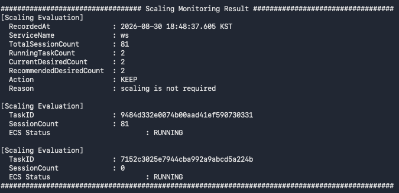
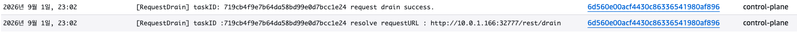
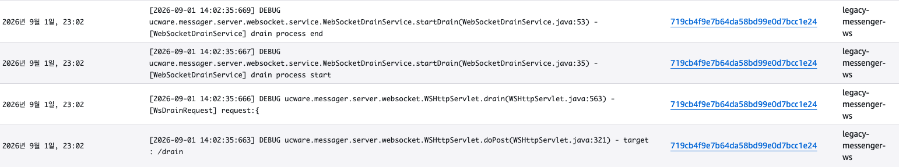
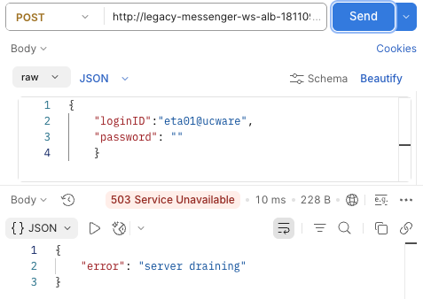
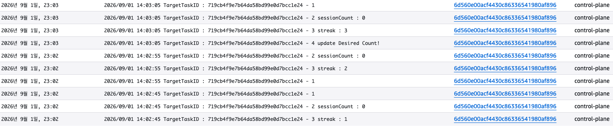
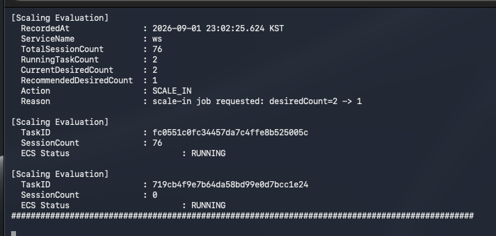
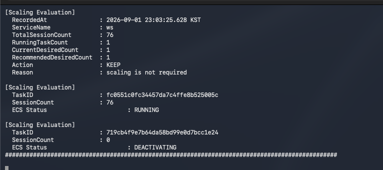
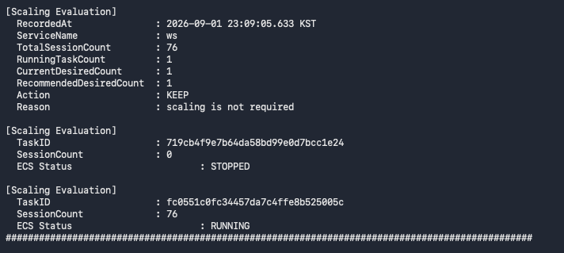

### TC-02. Normal Scale-in

#### Purpose

전체 WebSocket session 부하가 Scale-in 조건을 충족했을 때
Control Plane이 종료 대상 Task를 선정하고 Drain을 수행한 뒤,
session이 안전하게 제거된 것을 확인하여
ECS Service의 desired count를 감소시키는지 검증한다.

또한 유지 대상 Task를 보호하여
Scale-in 과정에서 활성 Task가 잘못 종료되지 않는지 확인한다.

---

#### Scaling Policy

테스트 환경에서는 하나의 WebSocket Task가 최대 100개의 session을
처리할 수 있다고 가정한다.

| Policy | Value |
|---|---:|
| Task Maximum Capacity | 100 sessions |
| Effective Capacity Ratio | 80% |
| Effective Capacity per Task | 80 sessions |
| Current Desired Count | 2 |
| Min Desired Count | 1 |
| Scale-in Step | -1 |
| Scale-in Condition Consecutive Count | 5 |
| Drain Completion Consecutive Count | 3 |
| Drain Completion Condition | Candidate Task sessionCount = 0 |

필요한 Task 수는 다음 기준으로 계산한다.

`Recommended Desired Count = ceil(Total Session Count / Effective Capacity per Task)`

예를 들어 전체 session이 80개인 경우:

`ceil(80 / 80) = 1`

따라서 현재 ECS desired count가 2라면
1개의 Task만으로 현재 session을 관리할 수 있다고 판단하여
Scale-in 조건이 성립할 수 있다.

반대로 전체 session이 81개인 경우:

`ceil(81 / 80) = 2`

이므로 현재 desired count가 2라면 Scale-in하지 않고
현재 capacity를 유지한다.

> Task당 100 sessions 및 Effective Capacity 80%는
> Control Plane의 scaling 동작 검증을 위해 정의한 테스트 기준이다.
> 실제 운영 환경에서는 부하 테스트 결과를 기반으로 적정 값을 산정해야 한다.

---

#### Scale-in Safety Policy

Scale-in은 두 단계의 연속 상태 검증을 거쳐 수행한다.

1. **Scale-in Condition Validation**
   - 전체 sessionCount를 기반으로 Recommended Desired Count를 계산한다.
   - Recommended Desired Count가 현재 desiredCount보다 작은 상태가
     연속 5회 유지된 경우 Scale-in 절차를 시작한다.

2. **Drain Completion Validation**
   - Control Plane이 Scale-in 대상 Task를 선정하고 Drain을 요청한다.
   - Drain 대상 Task는 신규 WebSocket connection을 차단하고
     기존 session 및 관련 서비스 자원을 정리한다.
   - 대상 Task의 `sessionCount=0` 상태가 연속 3회 확인된 경우에만
     Drain이 완료된 것으로 판단한다.
   - Drain 완료 이후 남은 Task에 Task Protection을 적용하고
     ECS Service의 desiredCount를 감소시킨다.

첫 번째 검증은 일시적인 부하 감소로 인한 불필요한 Scale-in을 방지하고,
두 번째 검증은 session이 남아 있는 Task가 조기에 종료되는 것을 방지한다.

---

#### Initial State

| Item | Value |
|---|---:|
| Total Sessions | 80 |
| Recommended Desired Count | 1 |
| ECS Desired | 2 |
| ECS Running | 2 |
| ECS Pending | 0 |
| ASG Desired | 2 |
| Scale-in Candidate | None |

예시 Task 상태:

| Task | Session Count | Status |
|---|---:|---|
| Task A | 70 | RUNNING |
| Task B | 10 | RUNNING |

전체 session은 80개이며,

`ceil(80 / 80) = 1`

이므로 Recommended Desired Count는 1이다.

현재 ECS desired count가 2이므로
Scale-in 조건이 성립할 수 있는 상태이다.

---

#### Test Procedure

1. ECS Service가 `desired=2 / running=2 / pending=0` 상태인지 확인한다.
2. 전체 sessionCount가 80이 되도록 session report를 발생시킨다.
3. Control Plane이 `Recommended Desired Count=1`로 계산하는지 확인한다.
4. `Recommended Desired Count < Current Desired Count` 상태가 연속 5회 유지되는지 확인한다.
5. 조건 충족 이후 Control Plane이 Scale-in 대상 Task를 선정하고 Drain 요청을 전달하는지 확인한다.
6. Drain 대상 Task가 신규 WebSocket connection을 차단하고, 기존 session이 감소하는지 확인한다.
7. Drain 대상 Task의 `sessionCount=0` 상태가 연속 3회 확인되는지 확인한다.
8. Drain 완료 후 유지 대상 Task에 Task Protection이 적용되는지 확인한다.
9. ECS desiredCount가 `2 → 1`로 변경되고 Drain 대상 Task가 `DEACTIVATING` 상태로 전환되는지 확인한다.
10. Drain 대상 Task가 `STOPPED`되고 보호된 Task가 RUNNING 상태를 유지하는지 확인한다.
11. 최종적으로 `desired=1 / running=1 / pending=0` 상태가 되는지 확인한다.

---

#### Pass Criteria

다음 조건을 모두 만족하면 테스트를 PASS로 판단한다.

- `Recommended Desired Count < Current Desired Count` 상태가 연속 5회 확인된 이후에만 Drain이 시작된다.
- Drain 대상 Task의 `sessionCount=0` 상태가 연속 3회 확인되기 전에는 ECS desiredCount가 감소하지 않는다.
- Drain 완료 후 유지 대상 Task가 보호된 상태에서 ECS desiredCount가 `2 → 1`로 감소한다.
- Drain 대상 Task만 `STOPPED`되고, 최종적으로 `desired=1 / running=1 / pending=0` 상태가 된다.

---

#### Result

PASS

---

#### Evidence

**1. Initial State**

Scale-in 이전 ECS Service가
`desired=2 / running=2 / pending=0` 상태임을 확인한다.

전체 sessionCount를 Effective Capacity 기준으로 계산했을 때
Recommended Desired Count가 현재 desired count보다 작아질 수 있는
초기 상태임을 확인한다.

---

**2. Scale-in Condition Confirmed**

전체 sessionCount가 80으로 감소하여

`ceil(80 / 80) = 1`

에 따라 `Recommended Desired Count=1`이 계산된 것을 확인한다.

현재 `desiredCount=2`보다 Recommended Desired Count가 작으며,
해당 Scale-in 조건이 연속 5회 유지시
Scale-in 대상 선정 조건이 충족된 것을 확인한다.

---

**3. Drain Requested**

Control Plane이 Scale-in 대상 Task를 선정하고
해당 Task에 Drain 요청을 전달한 것을 확인한다.

Drain 요청 이후 대상 서비스는 신규 WebSocket connection을
더 이상 수락하지 않고 기존 connection에 대한 Drain을 시작한다.

---

**4. Session Draining**

Drain 대상 Task가 신규 connection을 차단한 상태(Service Unavailable)에서
기존 WebSocket session을 순차적으로 종료하고
서비스 자원을 해제하는 과정을 확인한다.

이 과정에서 대상 Task는 sessionCount가 점차 감소시켜 0이 되도록한다.

---

**5. Drain Completion Confirmed**

Drain 대상 Task의 `sessionCount=0` 상태가
연속 3회 유지된 것을 확인한다.

이를 통해 일시적인 session report 변화가 아닌
안정적인 Drain 완료 상태임을 확인한 뒤에만
ECS capacity 감소를 진행한다.

---

**6. Task Protection & Scale-in Execution**

Drain 완료가 확인된 이후
계속 유지할 Task에 Task Protection을 적용하고,

ECS Service의 desiredCount를

`2 → 1`

로 변경한 것을 확인한다.

이를 통해 ECS Scale-in 과정에서 유지해야 할 Task가
종료 대상으로 선택되는 것을 방지한다.

---

**7. ECS Task Deactivating**

ECS desiredCount 감소 이후
Drain 대상 Task가 `DEACTIVATING` 상태로 전환된 것을 확인한다.

이 시점에도 Task Protection이 적용된 기존 Task는
RUNNING 상태를 유지한다.

---

**8. Scale-in Completed**

Drain 대상 Task가 최종적으로 STOPPED 상태가 되고,
ECS Service가

`desired=1 / running=1 / pending=0`

상태가 된 것을 확인한다.

Control Plane에서도 남은 Task 하나만 정상적으로 관리되고 있으며
Scale-in 프로세스가 종료된 것을 확인한다.

