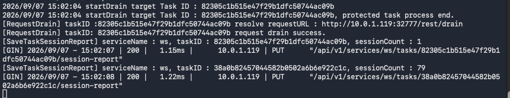
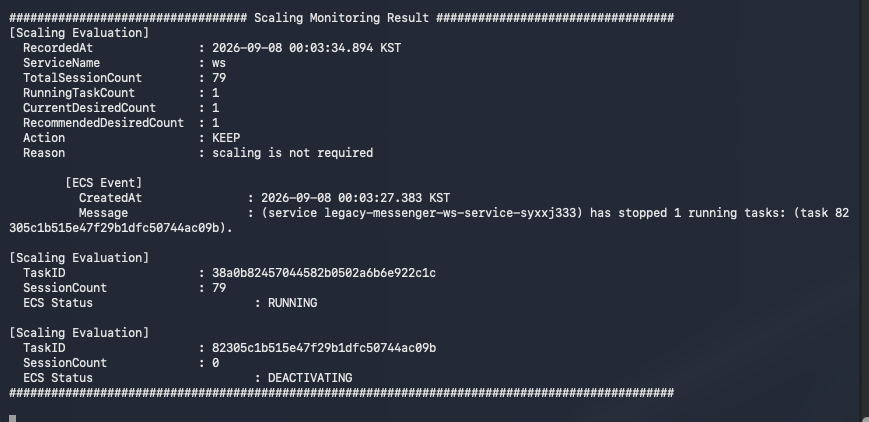
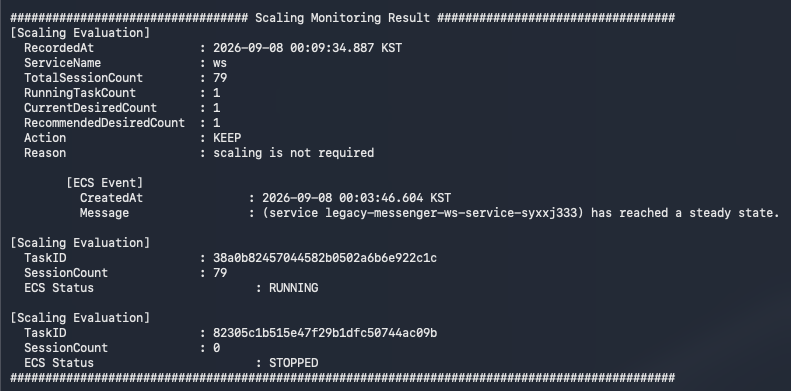

### TC-03. Active Session Protection

#### Purpose

Scale-in 대상 Task에 활성 WebSocket session이 남아 있는 경우
Control Plane이 해당 Task의 종료를 보류하고,
Drain 완료 조건이 충족될 때까지 ECS desired count를 감소시키지 않는지 검증한다.

> 공통 Scale-in 정책 및 Drain 절차는
> [TC-02. Normal Scale-in](./tc-02-normal-scale-in.md)을 따른다.

---

#### Initial State

| Item | Value |
|---|---:|
| Total Sessions | 80 |
| Recommended Task Count | 1 |
| ECS Desired | 2 |
| ECS Running | 2 |
| ECS Pending | 0 |

예시 Task 상태:

| Task | Session Count | Status |
|---|---:|---|
| Task A | 79 | RUNNING |
| Task B | 1 | RUNNING |

Task B는 Scale-in candidate로 선정되지만,
1개의 active session이 남아 있는 상태로 테스트한다.

---

#### Test Procedure

1. Scale-in 조건을 충족시켜 Task B에 Drain 요청을 전달한다.
2. Task B의 `sessionCount=1` 상태를 유지한다.
3. Control Plane이 `SCALE_IN` 판단을 유지하되, active session이 남아 있어 Drain 완료로 판단하지 않는지 확인한다.
4. active session이 남아 있는 동안 ECS desiredCount가 `2`로 유지되고 Task B가 RUNNING 상태를 유지하는지 확인한다.
5. 마지막 session을 종료한 뒤 `sessionCount=0` 상태가 연속 3회 확인되면 Scale-in 절차가 재개되는지 확인한다.

---

#### Pass Criteria

다음 조건을 모두 만족하면 테스트를 PASS로 판단한다.

- Drain 대상 Task에 `sessionCount > 0`인 동안 `SCALE_IN` 판단은 유지되지만, Drain 완료로 판단하지 않는다.
- active session이 존재하는 동안 ECS desiredCount가 `2`로 유지된다.
- Drain 대상 Task가 강제 종료되지 않고 `RUNNING` 상태를 유지한다.
- `sessionCount=0` 상태가 연속 3회 확인된 이후에만 ECS desiredCount가 `2 → 1`로 감소한다.

---

#### Note

본 테스트는 active session이 남아 있는 Task를 즉시 종료하지 않는
정상 보호 동작을 검증한다.

다만 Drain 대상 Task가 장시간 `sessionCount > 0` 상태를 유지하는 경우,
Scale-in 작업이 무기한 보류될 수 있다.
이 경우 일정 시간 이후 Scale-in 작업을 실패 처리하거나,
Drain을 취소하고 별도 알림을 발생시키는 timeout 정책이 필요하다.

해당 timeout 동작은 본 테스트의 PASS 기준에는 포함하지 않고,
별도 예외 케이스로 분리하여 검증한다.

---

#### Result

PASS

---

#### Evidence

**1. Drain Requested**

Scale-in candidate가 선정되고 Drain 요청이 전달된 것을 확인한다.

---

**2. Active Session Protection**

Drain 대상 Task에 `sessionCount=1`이 남아 있어
Control Plane이 `SCALE_IN` 판단을 유지하지만 Drain 완료로 판단하지 않고,
ECS desiredCount를 감소시키지 않는 것을 확인한다.

이 시점에도 ECS desiredCount는 `2`이고
대상 Task는 RUNNING 상태를 유지한다.

---

**3. Drain Completion Confirmed**

마지막 session 종료 후 `sessionCount=0` 상태가 연속 3회 확인되어
Drain 완료 조건을 충족한 것을 확인한다.

---

**4. Scale-in Resumed**

Drain 완료 조건 충족 이후 ECS desiredCount가 `2 → 1`로 감소하고,
대상 Task가 `DEACTIVATING → STOPPED`로 전이되는 것을 확인한다.

