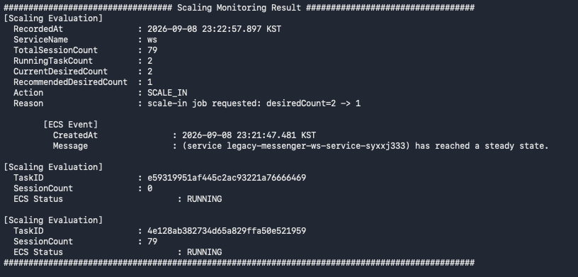
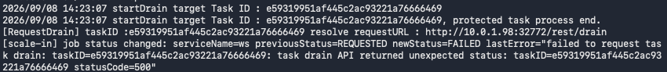
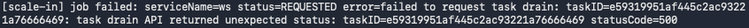
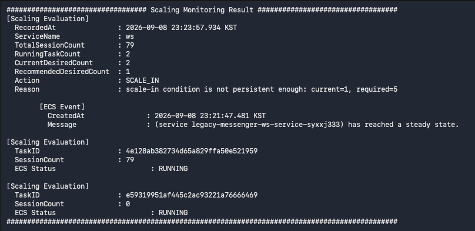
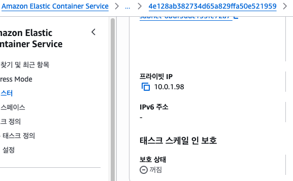

### TC-04. Drain Failure

#### Purpose

Scale-in 조건이 충족되어 Control Plane이 종료 대상 Task를 선정했지만,
대상 Task의 `/drain` API 호출이 실패한 경우
Scale-in 절차가 안전하게 중단되는지 검증한다.

Drain 요청이 실패한 상태에서는 대상 Task가 실제 Drain 상태로 전환되었다고
보장할 수 없으므로, Control Plane은 Drain 완료 판단을 수행하지 않고
ECS Service의 desired count를 감소시키지 않아야 한다.

> 공통 Scale-in 정책 및 Drain 완료 조건은
> [TC-02. Normal Scale-in](./tc-02-normal-scale-in.md)을 따른다.

---

#### Failure Scope

본 테스트에서는 Drain 단계의 여러 실패 유형 중
`/drain` API 호출 실패를 대표 시나리오로 검증한다.

다음과 같은 실패를 동일한 범주로 본다.

- `/drain` API connection refused
- `/drain` API timeout
- `/drain` API 5xx response
- `/drain` API가 2xx 이외의 status code를 반환하는 경우

Drain 요청은 성공했지만 대상 Task의 `sessionCount`가 0으로 감소하지 않는 경우는
[TC-03. Active Session Protection](./tc-03-active-session-protection.md)에서
검증하므로 본 테스트 범위에서 제외한다.

---

#### Initial State

| Item | Value |
|---|---:|
| Total Sessions | 80 |
| Recommended Task Count | 1 |
| ECS Desired | 2 |
| ECS Running | 2 |
| ECS Pending | 0 |
| Scale-in Job Status | None |

예시 Task 상태:

| Task | Session Count | Status |
|---|---:|---|
| Task A | 79 | RUNNING |
| Task B | 1 | RUNNING |

Task B는 가장 적은 session을 가진 Task이므로
Scale-in candidate로 선정될 수 있는 상태이다.

다만 테스트에서는 Task B의 `/drain` API가 정상 응답하지 않도록 구성한다.

---

#### Test Procedure

1. ECS Service가 `desired=2 / running=2 / pending=0` 상태인지 확인한다.
2. 전체 sessionCount가 80이 되도록 session report를 발생시킨다.
3. Control Plane이 `Recommended Desired Count=1`로 계산하는지 확인한다.
4. `Recommended Desired Count < Current Desired Count` 상태가 연속 5회 유지되는지 확인한다.
5. 조건 충족 이후 Control Plane이 Scale-in 대상 Task B를 선정하는지 확인한다.
6. Task B의 `/drain` API 호출이 실패하도록 대상 Task endpoint를 중단하거나 비정상 응답을 반환하도록 구성한다.
7. Control Plane이 Task B에 Drain 요청을 시도하고 실패를 감지하는지 확인한다.
8. Drain 요청 실패 이후 Scale-in job이 `FAILED` 상태로 전환되는지 확인한다.
9. ECS desiredCount가 `2`로 유지되고 Task B가 조기 종료되지 않는지 확인한다.
10. Drain 요청 전에 적용된 survivor Task protection이 원복되는지 확인한다.

---

#### Pass Criteria

다음 조건을 모두 만족하면 테스트를 PASS로 판단한다.

- Scale-in 조건이 연속 5회 확인된 이후에만 Drain 요청이 시도된다.
- `/drain` API 호출 실패가 Control Plane에서 error로 감지된다.
- Drain 요청 실패 시 Scale-in job이 `FAILED` 상태로 전환되고 실패 원인이 `LastError` 또는 로그에 남는다.
- Drain 요청에 실패한 Task를 Drain 완료로 판단하지 않는다.
- ECS Service의 desiredCount가 `2`로 유지되며 `2 → 1`로 감소하지 않는다.
- Drain 대상 Task가 강제 종료되지 않고 RUNNING 상태를 유지한다.
- Drain 요청 실패 이전에 생존 예정 Task에 Task Protection이 적용되었다면, 실패 처리 과정에서 해당 protection이 해제된다.

---

#### Note

Drain 실패는 요청 실패뿐 아니라 상태 전이 실패, 완료 조건 미충족,
상태 관측 실패 등 여러 단계에서 발생할 수 있다.

본 테스트는 그중 가장 앞단인 `/drain` 요청 경계에서 실패가 발생했을 때,
Control Plane이 이후 Scale-in 절차를 진행하지 않는지 검증하는 데 집중한다.

`/drain` 요청 성공 이후 대상 Task가 Drain 상태로 전환되지 않거나,
Drain 진행 중 상태 확인이 불가능해지는 경우에는
별도의 retry, timeout, failure recovery 정책이 필요하므로
본 테스트의 PASS 기준에서는 제외한다.

Drain 요청 실패 시 해당 Scale-in job은 `FAILED` 상태로 종료되며,
ECS desiredCount는 유지된다.

이후에도 session 부하가 Scale-in 조건을 계속 만족하는 경우,
다음 Scale-in condition validation을 다시 통과한 뒤
새로운 Scale-in job이 생성될 수 있다.

---

#### Result

PASS

---

#### Evidence

**1. Scale-in Condition Confirmed**

전체 sessionCount가 80으로 감소하여
`Recommended Desired Count=1`이 계산되고,
Scale-in 조건이 연속 5회 유지되어
Scale-in job이 등록된 것을 확인한다.

---

**2. Drain Request Failed**

Control Plane이 Scale-in 대상 Task에 `/drain` 요청을 시도했지만,
connection refused, timeout, 5xx 또는 non-2xx status code로 인해
Drain 요청이 실패한 것을 확인한다.

---

**3. Scale-in Job Failed**

Drain 요청 실패 이후 Scale-in job이 `FAILED` 상태로 전환되고,
실패 원인이 로그 또는 `LastError`에 기록된 것을 확인한다.

---

**4. ECS Desired Count Preserved**

Drain 요청이 실패하여 대상 Task가 Drain 상태로 전환되지 않았으므로
ECS Service의 desiredCount가 `2`로 유지되고,
Drain 대상 Task가 조기 종료되지 않는 것을 확인한다.

---

**5. Task Protection Rollback**

Drain 대상 Task B를 제외한 survivor Task A에 Task Protection이 적용된 경우,
Drain 요청 실패 처리 과정에서 Task A의 Task Protection이 해제된 것을 AWS Console에서 확인한다.

