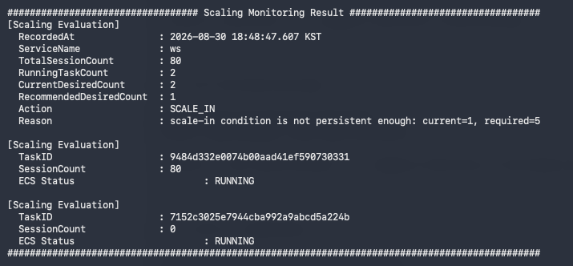

### TC-05. Scaling Boundary

#### Purpose

Scaling threshold의 경계값에서 필요한 Task 수가 정확하게 계산되는지 검증한다.

Task당 유효 처리량이 80 sessions인 경우,
전체 session 수에 따른 Required Task Count는 다음과 같이 판단되어야 한다.

| Total Sessions | Required Task Count |
|---:|---:|
| 80 | 1 |
| 81 | 2 |

이를 통해 threshold 경계에서 off-by-one 오류로 인해
불필요한 Scale-in 또는 Scale-out이 발생하지 않는지 확인한다.

---

#### Scaling Policy

테스트 환경에서는 하나의 WebSocket Task가 최대 100개의 session을
처리할 수 있다고 가정한다.

| Policy | Value |
|---|---:|
| Task Maximum Capacity | 100 sessions |
| Effective Capacity Ratio | 80% |
| Effective Capacity per Task | 80 sessions |
| Scale-out Threshold | 80 sessions (80%) |
| Min Desired Count | 1 |

필요한 Task 수는 다음 기준으로 계산한다.

`Required Task Count = ceil(Total Session Count / Effective Capacity per Task)`

따라서 전체 session이 80개인 경우:

`ceil(80 / 80) = 1`

이므로 1개의 Task로 현재 session을 처리할 수 있다고 판단한다.

반대로 전체 session이 81개인 경우:

`ceil(81 / 80) = 2`

이므로 1개의 Task로는 유효 처리량을 초과한 상태이며,
2개의 Task가 필요하다고 판단한다.

> 본 테스트는 별도의 신규 Scale-in / Scale-out 절차를 반복하지 않고,
> 기존 테스트 케이스의 정책 설명과 실행 증적을 통해
> 경계값 계산이 올바르게 적용되었는지 확인한다.

---

#### Verification Scope

본 테스트는 다음 경계값 판단을 검증 범위로 한다.

| Boundary Case | Expected Decision | Reference |
|---|---|---|
| `Total Sessions = 80` | `Required Task Count = 1` | [TC-02. Normal Scale-in](./tc-02-normal-scale-in.md) |
| `Total Sessions = 81` | `Required Task Count = 2` | [TC-01. Normal Scale-out](./tc-01-normal-scale-out.md), [TC-02. Normal Scale-in](./tc-02-normal-scale-in.md) |
| Scale-in candidate에 active session 존재 | ECS desired count 유지 | [TC-03. Active Session Protection](./tc-03-active-session-protection.md) |
| Drain 요청 실패 | ECS desired count 유지 | [TC-04. Drain Failure](./tc-04-drain-failure.md) |

TC-03과 TC-04는 Required Task Count 계산 자체를 검증하는 테스트는 아니지만,
Scale-in 판단 이후에도 session 보호 및 Drain 실패 조건에서
ECS desired count가 조기 감소하지 않는지 확인하는 보조 증적으로 사용한다.

---

#### Test Procedure

1. TC-02에서 정의한 Required Task Count 계산 기준을 확인한다.
2. 전체 session이 80개인 경우 `ceil(80 / 80) = 1`로 계산되는지 확인한다.
3. TC-02의 Scale-in 조건 확인 증적에서 `Recommended Desired Count=1`로 판단된 것을 확인한다.
4. 전체 session이 81개인 경우 `ceil(81 / 80) = 2`로 계산되는지 확인한다.
5. TC-01의 Scale-out 증적에서 `sessionCount=81` 상태가 Scale-out threshold를 초과하여 추가 Task가 필요하다고 판단된 것을 확인한다.
6. TC-03, TC-04를 통해 Scale-in 판단 이후에도 active session 또는 Drain 실패 상황에서 ECS desired count가 불필요하게 감소하지 않는지 확인한다.

---

#### Pass Criteria

다음 조건을 모두 만족하면 테스트를 PASS로 판단한다.

- 전체 session이 `80`인 경우 Required Task Count가 `1`로 계산된다.
- 전체 session이 `81`인 경우 Required Task Count가 `2`로 계산된다.
- `80 sessions` 경계값에서 Required Task Count가 `2`로 잘못 계산되어 불필요한 Scale-out이 발생하지 않는다.
- `81 sessions` 경계값에서 Required Task Count가 `1`로 잘못 계산되어 불필요한 Scale-in이 발생하지 않는다.
- Scale-in 판단 이후에도 active session 또는 Drain 실패 조건에서는 ECS desired count가 조기 감소하지 않는다.

---

#### Result

PASS

---

#### Evidence

**1. Required Task Count Calculation**

TC-02의 Scaling Policy에서 Required Task Count 계산 기준이
다음과 같이 정의되어 있음을 확인한다.

`Required Task Count = ceil(Total Session Count / Effective Capacity per Task)`

Task당 유효 처리량이 80 sessions이므로,
전체 session이 80개인 경우 Required Task Count는 1이다.

`ceil(80 / 80) = 1`

전체 session이 81개인 경우 Required Task Count는 2이다.

`ceil(81 / 80) = 2`

참조: [TC-02. Normal Scale-in](./tc-02-normal-scale-in.md)

---

**2. Boundary at 80 Sessions**

TC-02에서 전체 sessionCount가 80으로 감소했을 때
`Recommended Desired Count=1`로 계산된 것을 확인한다.

이를 통해 threshold 이하의 경계값에서
1개의 Task로 현재 session을 처리할 수 있다고 판단하며,
Required Task Count가 2로 잘못 증가하지 않는 것을 확인한다.

---

**3. Boundary at 81 Sessions**

TC-01에서 Task의 `sessionCount=81` 상태가
Scale-out threshold를 초과한 것으로 감지되고,
연속 조건 충족 이후 ECS Service의 desiredCount가 `1 → 2`로 증가한 것을 확인한다.

이를 통해 threshold를 1 session 초과한 경계값에서
2개의 Task가 필요하다고 판단하며,
Required Task Count가 1로 잘못 유지되지 않는 것을 확인한다.

---

**4. Scale-in Safety at Boundary**

TC-03에서 Scale-in 대상 Task에 active session이 남아 있는 동안
ECS desiredCount가 감소하지 않고,
Drain 완료 조건이 충족된 이후에만 Scale-in이 재개되는 것을 확인한다.

이를 통해 Required Task Count가 감소 가능한 상태로 계산되더라도,
active session이 남아 있는 Task가 조기 종료되지 않는 것을 확인한다.

참조: [TC-03. Active Session Protection](./tc-03-active-session-protection.md)

---

**5. Drain Failure Safety at Boundary**

TC-04에서 Drain 요청이 실패한 경우
Scale-in job이 `FAILED` 상태로 전환되고,
ECS Service의 desiredCount가 `2`로 유지되는 것을 확인한다.

이를 통해 Scale-in 경계 조건이 충족된 경우에도
Drain이 보장되지 않으면 ECS desired count를 감소시키지 않는 것을 확인한다.

참조: [TC-04. Drain Failure](./tc-04-drain-failure.md)
